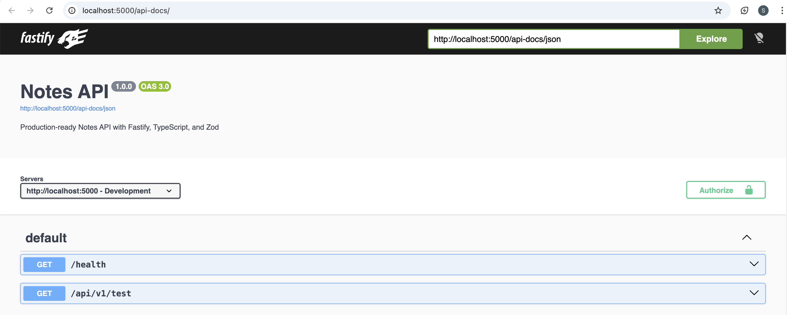
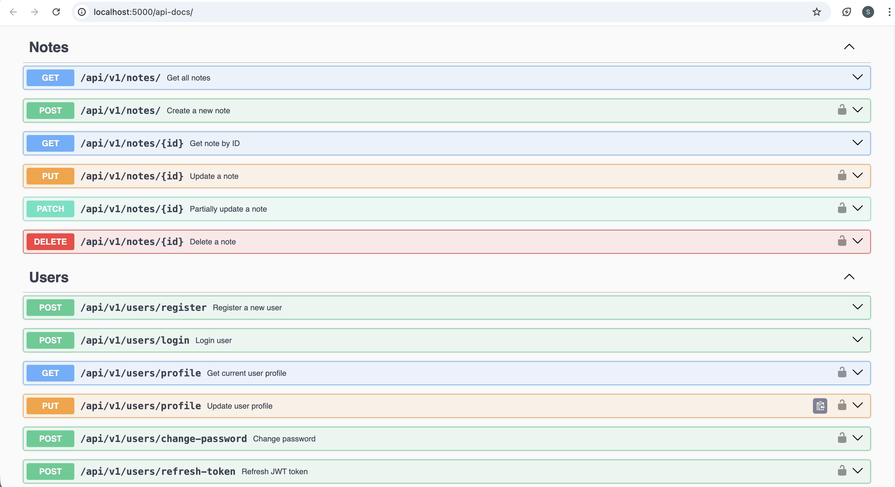

# 🚀 Backend Application

A **REST API** and **GraphQL** server using **Fastify**, **TypeScript**, **Zod**, and **MSSQL**.

[](https://github.com/satheeshpolu/backend-application/actions)
[](https://opensource.org/licenses/MIT)

---

## 📋 Table of Contents

- [Features](#-features)
- [Tech Stack](#-tech-stack)
- [Project Architecture](#-project-architecture)
- [Getting Started](#-getting-started)
- [Environment Variables](#-environment-variables)
- [API Documentation](#-api-documentation)
  - [Swagger UI Screenshots](#-swagger-ui-screenshots)
  - [REST API Endpoints](#rest-api-endpoints)
  - [GraphQL API](#graphql-api)
- [Scripts](#-scripts)
- [Testing](#-testing)
- [Docker](#-docker)
- [Contributing](#-contributing)

---

## ✨ Features

- 🔐 **JWT Authentication** - Secure token-based authentication
- 🛡️ **Security** - Helmet, CORS, Rate limiting
- 📝 **Validation** - Zod schema validation
- 📊 **Dual API** - Both REST and GraphQL endpoints
- 📚 **Auto Documentation** - Swagger UI for REST, GraphiQL for GraphQL
- 🗄️ **MSSQL Database** - Microsoft SQL Server with connection pooling
- 🔄 **Redis Support** - Optional Redis for distributed rate limiting
- 📦 **TypeScript** - Full type safety
- ✅ **Testing** - Jest with integration tests
- 🔧 **Code Quality** - ESLint, Prettier, Husky pre-commit hooks
- 🐳 **Docker Ready** - Containerized deployment
- 🚀 **PM2 Support** - Production process management

---

## 🛠️ Tech Stack

| Category | Technology |
|----------|------------|
| **Runtime** | Node.js 18+ |
| **Framework** | Fastify 5.x |
| **Language** | TypeScript 5.x |
| **Validation** | Zod |
| **GraphQL** | Mercurius |
| **Database** | Microsoft SQL Server |
| **Caching** | Redis (optional) |
| **Auth** | JWT (@fastify/jwt) |
| **Docs** | Swagger UI, GraphiQL |
| **Testing** | Jest |
| **Linting** | ESLint + Prettier |

---

## 🏗️ Project Architecture

```
src/
├── app.ts                    # Fastify application factory
├── server.ts                 # Server entry point
│
├── config/                   # Configuration
│   ├── index.ts              # App configuration (env variables)
│   └── database.ts           # MSSQL connection pool
│
├── graphql/                  # GraphQL Layer
│   ├── index.ts              # Mercurius plugin setup
│   ├── schema.ts             # GraphQL type definitions
│   └── resolvers.ts          # Query & Mutation resolvers
│
├── modules/                  # REST API Modules (Domain-driven)
│   ├── notes/
│   │   ├── index.ts          # Module exports
│   │   ├── notes.controller.ts   # Request handlers
│   │   ├── notes.routes.ts       # Route definitions
│   │   └── notes.service.ts      # Business logic
│   └── users/
│       ├── index.ts
│       ├── users.controller.ts
│       ├── users.routes.ts
│       └── users.service.ts
│
├── plugins/                  # Fastify Plugins
│   ├── auth.ts               # JWT authentication
│   ├── redis.ts              # Redis connection
│   └── validation.ts         # Zod validation middleware
│
├── schemas/                  # Zod Validation Schemas
│   ├── index.ts              # Schema exports
│   ├── common.schema.ts      # Shared schemas (pagination, etc.)
│   ├── note.schema.ts        # Note validation schemas
│   └── user.schema.ts        # User validation schemas
│
├── types/                    # TypeScript Types
│   ├── index.ts              # Global type definitions
│   └── fastify.d.ts          # Fastify module augmentation
│
└── utils/                    # Utilities
    └── response.ts           # Response helpers
```

### Architecture Diagram

```
┌─────────────────────────────────────────────────────────────────┐
│                        Client Request                           │
└─────────────────────────────────────────────────────────────────┘
                               │
                               ▼
┌─────────────────────────────────────────────────────────────────┐
│                      Fastify Server                             │
│  ┌─────────────┐  ┌─────────────┐  ┌─────────────────────────┐  │
│  │   Helmet    │  │    CORS     │  │     Rate Limiter        │  │
│  └─────────────┘  └─────────────┘  └─────────────────────────┘  │
└─────────────────────────────────────────────────────────────────┘
                               │
              ┌────────────────┴────────────────┐
              │                                 │
              ▼                                 ▼
┌─────────────────────────┐       ┌─────────────────────────┐
│      REST API           │       │       GraphQL           │
│   /api/v1/*             │       │      /graphql           │
│                         │       │      /graphiql          │
│  ┌─────────────────┐    │       │                         │
│  │    Routes       │    │       │  ┌─────────────────┐    │
│  └────────┬────────┘    │       │  │    Resolvers    │    │
│           │             │       │  └────────┬────────┘    │
│  ┌────────▼────────┐    │       │           │             │
│  │   Controllers   │    │       └───────────┼─────────────┘
│  └────────┬────────┘    │                   │
└───────────┼─────────────┘                   │
            │                                 │
            └────────────────┬────────────────┘
                             │
                             ▼
              ┌─────────────────────────┐
              │       Services          │
              │   (Business Logic)      │
              └───────────┬─────────────┘
                          │
                          ▼
              ┌─────────────────────────┐
              │    MSSQL Database       │
              └─────────────────────────┘
```

---

## 🚀 Getting Started

### Prerequisites

- Node.js 18+
- Microsoft SQL Server
- Redis (optional)

### Installation

```bash
# Clone the repository
git clone https://github.com/satheeshpolu/backend-application.git

# Navigate to the project
cd backend-application

# Install dependencies
npm install

# Copy environment file
cp .env.example .env

# Configure your .env file with database credentials

# Build the project
npm run build

# Start development server
npm run dev
```

### Quick Start URLs

| Service | URL |
|---------|-----|
| **REST API** | http://localhost:5000/api/v1 |
| **Swagger Docs** | http://localhost:5000/api-docs |
| **GraphQL API** | http://localhost:5000/graphql |
| **GraphiQL IDE** | http://localhost:5000/graphiql |
| **Health Check** | http://localhost:5000/health |

---

## 🔐 Environment Variables

Create a `.env` file in the root directory:

```env
# Server
NODE_ENV=development
PORT=5000
HOST=0.0.0.0

# JWT
JWT_SECRET=your-super-secret-jwt-key-change-in-production
JWT_EXPIRES_IN=7d

# Database (MSSQL)
DB_USER=sa
DB_PASSWORD=your_password
DB_SERVER=localhost
DB_NAME=notes_db
DB_PORT=1433
DB_ENCRYPT=true
DB_TRUST_SERVER_CERT=true

# Redis (optional - for distributed rate limiting)
REDIS_URL=redis://localhost:6379

# Rate Limiting
RATE_LIMIT_MAX=100
RATE_LIMIT_WINDOW=1 minute

# CORS
CORS_ORIGINS=http://localhost:3000,http://localhost:8080
```

---

## 📚 API Documentation

### 📸 Swagger UI Screenshots

> **Interactive API Documentation** available at `http://localhost:5000/api-docs`

#### Overview
*Swagger UI showing all available API endpoints*



> 📝 **Note:** To add your own screenshots:
> 1. Create a `docs/screenshots/` folder
> 2. Run the server: `npm run dev`
> 3. Open `http://localhost:5000/api-docs`
> 4. Take screenshots and save them with the names above

---

### REST API Endpoints

#### 🔓 Public Endpoints

| Method | Endpoint | Description |
|--------|----------|-------------|
| `GET` | `/health` | Health check |
| `GET` | `/api/v1/notes` | Get all notes (paginated) |
| `GET` | `/api/v1/notes/:id` | Get note by ID |

#### 🔐 Authentication

| Method | Endpoint | Description |
|--------|----------|-------------|
| `POST` | `/api/v1/users/register` | Register new user |
| `POST` | `/api/v1/users/login` | Login user |
| `POST` | `/api/v1/users/refresh` | Refresh JWT token |

#### 🔒 Protected Endpoints (Require JWT)

| Method | Endpoint | Description |
|--------|----------|-------------|
| `GET` | `/api/v1/users/profile` | Get current user profile |
| `PUT` | `/api/v1/users/profile` | Update user profile |
| `PUT` | `/api/v1/users/password` | Change password |
| `POST` | `/api/v1/notes` | Create a note |
| `PUT` | `/api/v1/notes/:id` | Update a note |
| `DELETE` | `/api/v1/notes/:id` | Delete a note |

#### Example Requests

**Register a User:**
```bash
curl -X POST http://localhost:5000/api/v1/users/register \
  -H "Content-Type: application/json" \
  -d '{
    "email": "user@example.com",
    "username": "johndoe",
    "password": "SecurePass123!"
  }'
```

**Login:**
```bash
curl -X POST http://localhost:5000/api/v1/users/login \
  -H "Content-Type: application/json" \
  -d '{
    "email": "user@example.com",
    "password": "SecurePass123!"
  }'
```

**Create a Note (Protected):**
```bash
curl -X POST http://localhost:5000/api/v1/notes \
  -H "Content-Type: application/json" \
  -H "Authorization: Bearer YOUR_JWT_TOKEN" \
  -d '{
    "title": "My First Note",
    "content": "This is the content of my note."
  }'
```

---

### GraphQL API

**Endpoint:** `POST /graphql`  
**GraphiQL IDE:** `GET /graphiql`

#### Queries

```graphql
# Get all notes with pagination
query GetNotes {
  notes(page: 1, limit: 10) {
    data {
      id
      title
      content
      createdAt
    }
    pagination {
      total
      totalPages
      page
      limit
    }
  }
}

# Get a single note
query GetNote {
  note(id: "1") {
    id
    title
    content
    userId
    createdAt
  }
}

# Get current user's notes (requires auth)
query MyNotes {
  myNotes(page: 1, limit: 10) {
    data {
      id
      title
    }
    pagination {
      total
    }
  }
}

# Get current user profile (requires auth)
query Me {
  me {
    id
    email
    username
    createdAt
  }
}

# Get all users
query GetAllUsers {
  getAllUsers {
    id
    user_id
    username
    email
  }
}

# Get user by ID
query GetUser {
  getUser(user_id: "1") {
    id
    username
    email
  }
}
```

#### Mutations

```graphql
# Register a new user
mutation Register {
  register(
    email: "user@example.com"
    username: "johndoe"
    password: "SecurePass123!"
  ) {
    token
    user {
      id
      email
      username
    }
  }
}

# Login
mutation Login {
  login(email: "user@example.com", password: "SecurePass123!") {
    token
    user {
      id
      email
    }
  }
}

# Create a note (requires auth)
mutation CreateNote {
  createNote(title: "My Note", content: "Note content here") {
    id
    title
    content
    createdAt
  }
}

# Update a note (requires auth)
mutation UpdateNote {
  updateNote(id: "1", title: "Updated Title", content: "Updated content") {
    id
    title
    content
    updatedAt
  }
}

# Delete a note (requires auth)
mutation DeleteNote {
  deleteNote(id: "1")
}

# Create user (legacy)
mutation CreateUser {
  createUser(username: "newuser", email: "new@example.com") {
    id
    username
    email
  }
}

# Change password (requires auth)
mutation ChangePassword {
  changePassword(currentPassword: "oldpass", newPassword: "newpass")
}
```

#### GraphQL with Authentication

Add the JWT token to the request headers:

```bash
curl -X POST http://localhost:5000/graphql \
  -H "Content-Type: application/json" \
  -H "Authorization: Bearer YOUR_JWT_TOKEN" \
  -d '{
    "query": "query { me { id email username } }"
  }'
```

---

## 📜 Scripts

| Script | Description |
|--------|-------------|
| `npm run dev` | Start development server with hot reload |
| `npm run build` | Compile TypeScript to JavaScript |
| `npm start` | Start production server |
| `npm test` | Run tests |
| `npm run test:watch` | Run tests in watch mode |
| `npm run test:coverage` | Run tests with coverage report |
| `npm run lint` | Run ESLint |
| `npm run lint:fix` | Fix ESLint issues |
| `npm run format` | Format code with Prettier |
| `npm run format:check` | Check code formatting |
| `npm run typecheck` | Type check without emitting |
| `npm run pm2:start` | Start with PM2 (production) |
| `npm run pm2:stop` | Stop PM2 processes |
| `npm run pm2:logs` | View PM2 logs |

---

## 🧪 Testing

```bash
# Run all tests
npm test

# Run tests in watch mode
npm run test:watch

# Run tests with coverage
npm run test:coverage
```

### Test Structure

```
tests/
├── integration/
│   └── notes.api.test.js    # API integration tests
├── unit/
│   └── notes.service.test.js # Service unit tests
└── setup.js                  # Test configuration
```

---

## 🐳 Docker

### Using Docker Compose

```bash
# Start all services (app + MSSQL + Redis)
docker-compose up -d

# View logs
docker-compose logs -f

# Stop services
docker-compose down
```

### Using Dockerfile

```bash
# Build image
docker build -t backend-application .

# Run container
docker run -p 5000:5000 --env-file .env backend-application
```

See [README-DOCKER.MD](./README-DOCKER.MD) for detailed Docker instructions.

---

## 🔒 Security Features

- **Helmet** - Sets security HTTP headers
- **CORS** - Configurable Cross-Origin Resource Sharing
- **Rate Limiting** - Prevent abuse (100 requests/minute default)
- **JWT Authentication** - Secure token-based auth
- **Input Validation** - Zod schema validation
- **SQL Injection Prevention** - Parameterized queries
- **Password Hashing** - bcrypt with salt rounds

---

## 📦 Deployment

### PM2 (Recommended for VPS)

```bash
# Build and start with PM2
npm run pm2:start

# View status
pm2 status

# View logs
npm run pm2:logs
```

### Environment-Specific Configs

The app automatically adjusts based on `NODE_ENV`:

| Feature | Development | Production |
|---------|-------------|------------|
| Logging | Pretty print | JSON format |
| Log Level | `info` | `warn` |
| Swagger | Enabled | Enabled |
| GraphiQL | Enabled | Can be disabled |
| Error Details | Full stack trace | Generic messages |

---

## 🤝 Contributing

1. Fork the repository
2. Create a feature branch (`git checkout -b feature/amazing-feature`)
3. Commit your changes (`git commit -m 'feat: add amazing feature'`)
4. Push to the branch (`git push origin feature/amazing-feature`)
5. Open a Pull Request

### Commit Convention

This project uses [Conventional Commits](https://www.conventionalcommits.org/):

- `feat:` - New feature
- `fix:` - Bug fix
- `docs:` - Documentation
- `style:` - Formatting
- `refactor:` - Code refactoring
- `test:` - Tests
- `chore:` - Maintenance

---

## 📄 License

This project is licensed under the MIT License - see the [LICENSE](LICENSE) file for details.

---

## 👤 Author

**Satheesh Polu**

- GitHub: [@satheeshpolu](https://github.com/satheeshpolu)

---

## 🙏 Acknowledgments

- [Fastify](https://www.fastify.io/) - Fast and low overhead web framework
- [Mercurius](https://mercurius.dev/) - GraphQL adapter for Fastify
- [Zod](https://zod.dev/) - TypeScript-first schema validation
