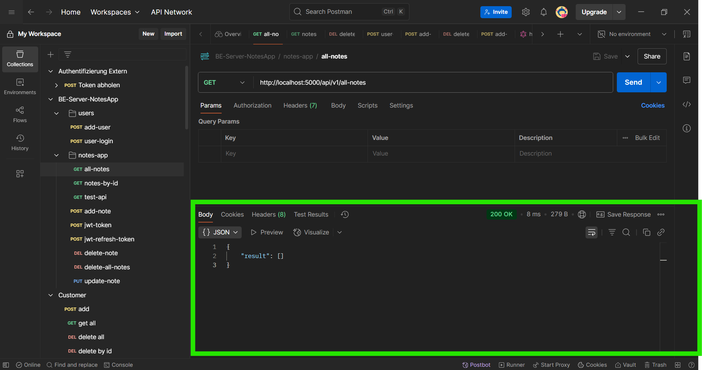
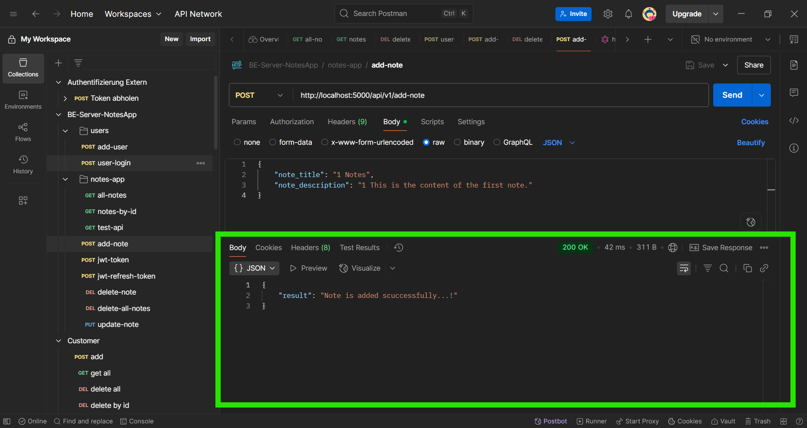
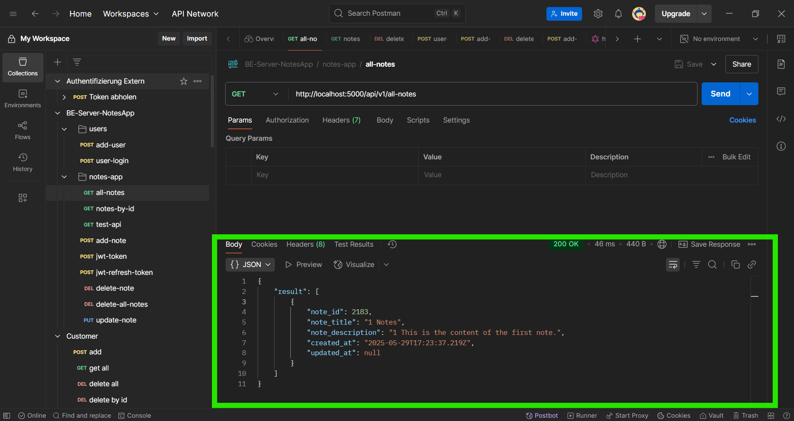
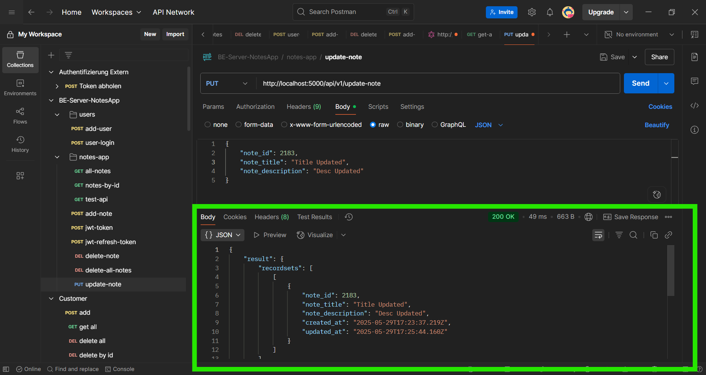
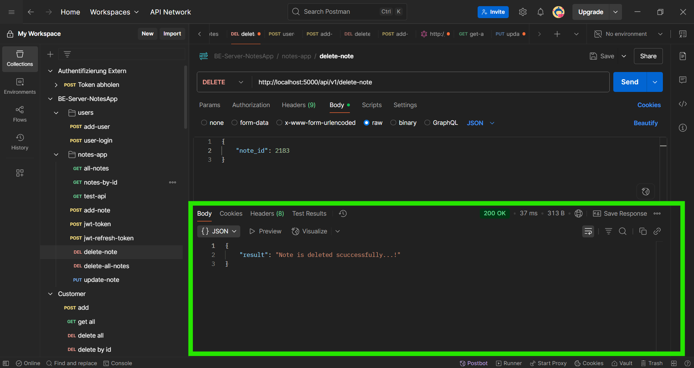
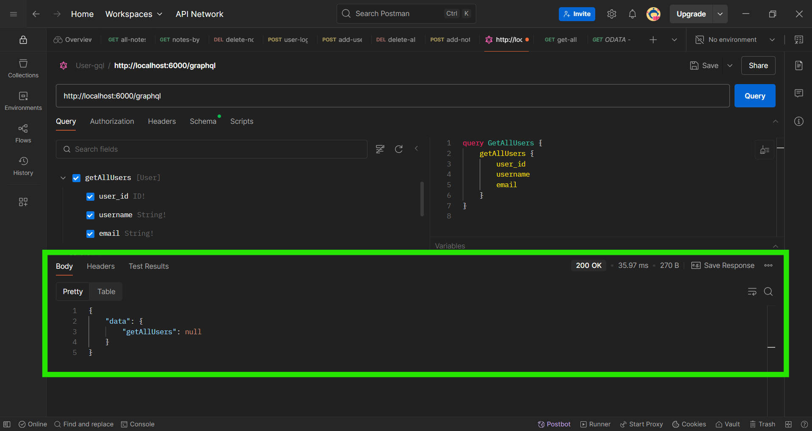
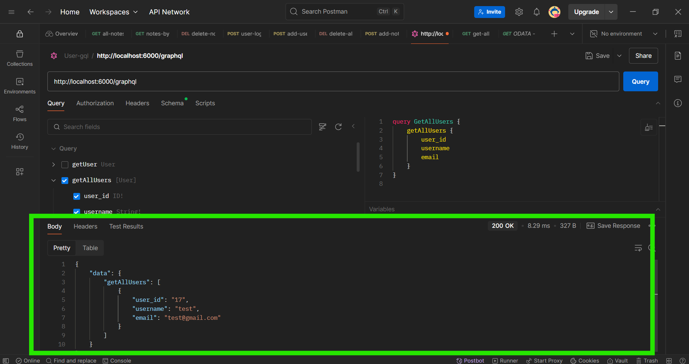
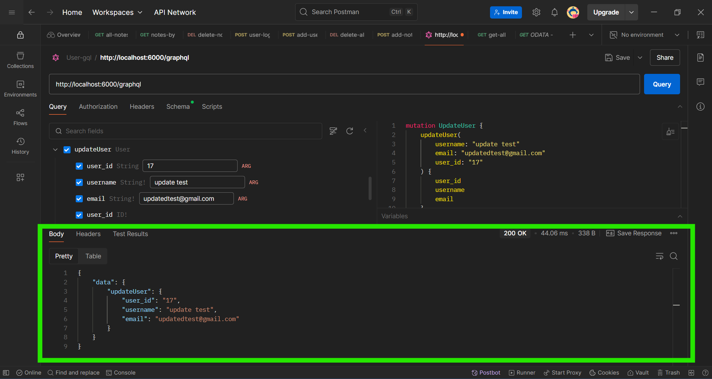
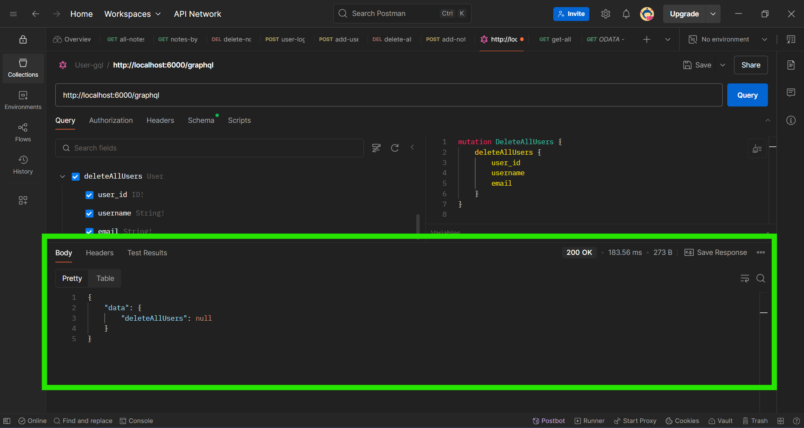

# Backend Application

MSSQL + ExpressJS + REST API

# Steps

1. Clone the repo `https://github.com/satheeshpolu/backend-application`
2. Go to root-directory of the `backend-application` in the terminal/cmd prompt
3. Run commands below and It will install all the dependencies
   `npm i` or `npm install`

## Setup MSSQL Server in your machine

Note: Please adhere to the instructions provided on the official website to complete the setup.

## Setup Database config

1. Create `.env` file
2. Copy-Pase the `.env-example` content into the `.env` file
3. Provide all the information mentioned in the `.env` file
4. Restart the backend server by pressing CTL+C
5. Run `npm start` command for REST API'ss
6. Run `npm run start-graphql` command for GraphQL API's
7. If Database is set properly configured then we should have access to `http://localhost:5000/api/v1/test` endpoint
8. Before we dive deep into all other endpoints please try to run schema mentioned at `src\batabase_operations\notes_app.schema.README.md`
9. All REST API endpoints are mentioned at `src\rest-api\README.md`


# 📝 Notes REST API Documentation

Base URL: `http://localhost:5000/api/v1`

---

## 1. 📄 Get All Notes

**Endpoint:** `GET /all-notes`  
**Description:** Retrieves a list of all notes.  
**Response Example:**
```json
[
  {
    "note_id": 1,
    "note_title": "First Note",
    "note_description": "This is the first note."
  },
  ...
]
```
# Initially there is no data:


---

## 2. ➕ Add a New Note

**Endpoint:** `POST /add-note`  
**Description:** Adds a new note with a title and description.  
**Payload:**
```json
{
  "note_title": "1 Notes",
  "note_description": "1 This is the content of the first note."
}
```
**Response Example:**
```json
{
  "message": "Note is added successfully...!",
  "note_id": 2183
}
```


---

## 3. ✏️ Update a Note

**Endpoint:** `PUT /update-note`  
**Description:** Updates the title and/or description of an existing note by its `note_id`.  
**Payload:**
```json
{
  "note_id": 2183,
  "note_title": "Title Updated",
  "note_description": "Desc Updated"
}
```
**Response Example:**
```json
{
  "message": "Note updated successfully."
}
```


---

## 4. ❌ Delete a Note

**Endpoint:** `DELETE /delete-note`  
**Description:** Deletes a note using its `note_id`.  
**Payload:**
```json
{
  "note_id": 2183
}
```
**Response Example:**
```json
{
  "message": "Note deleted successfully."
}
```

---

## 5. 🧹 Delete All Notes

**Endpoint:** `DELETE /delete-all-notes`  
**Description:** Deletes all notes from the database. This action is irreversible.  
**Response Example:**
```json
{
  "message": "All notes deleted successfully."
}
```

---

## ⚠️ Notes

- All endpoints use `application/json` for both requests and responses.
- Ensure proper error handling for invalid inputs or missing fields.
- `note_id` is required for update and delete operations.

---


# 🔗 GraphQL User Management API

This API provides CRUD operations to manage user data using GraphQL.

---

## 📌 Endpoint

```
http://localhost:6000/graphql
```

Use a GraphQL client like [GraphQL Playground](https://github.com/graphql/graphql-playground) or [Postman](https://www.postman.com/) to interact with the API.

---

## 🔧 Operations

### ➕ 1. `createUser`

**Mutation:**
```graphql
mutation {
  createUser(username: "johndoe", email: "john@example.com") {
    username
    email
  }
}
```

**Response:**
```json
{
  "data": {
    "createUser": {
      "username": "johndoe",
      "email": "john@example.com"
    }
  }
}
```

---

### 🧾 2. `User` (Query All Users)

**Query:**
```graphql
query {
  users {
    id
    username
    email
  }
}
```

**Response:**
```json
{
  "data": {
    "users": [
      {
        "id": 1,
        "username": "johndoe",
        "email": "john@example.com"
      },
      ...
    ]
  }
}
```

---

### ✏️ 3. `updateUser`

**Mutation:**
```graphql
mutation {
  updateUser(id: 1, username: "johnsmith", email: "smith@example.com") {
    username
    email
  }
}
```

**Response:**
```json
{
  "data": {
    "updateUser": {
      "username": "johnsmith",
      "email": "smith@example.com"
    }
  }
}
```

---

### ❌ 4. `deleteUser`

**Mutation:**
```graphql
mutation {
  deleteUser(id: 1) {
    username
    email
  }
}
```

**Response:**
```json
{
  "data": {
    "deleteUser": {
      "username": "johnsmith",
      "email": "smith@example.com"
    }
  }
}
```

---

### 🧹 5. `deleteAllUsers`

**Mutation:**
```graphql
mutation {
  deleteAllUsers {
    username
    email
  }
}
```

**Response:**
```json
{
  "data": {
    "deleteAllUsers": [
      {
        "username": "johndoe",
        "email": "john@example.com"
      },
      ...
    ]
  }
}
```

---

## ⚠️ Notes

- All responses are wrapped in a `data` object per GraphQL spec.
- Errors will be returned in an `errors` array if the query or mutation fails.
- Make sure your GraphQL server is running before testing.

---

## 🛡️ License

MIT
